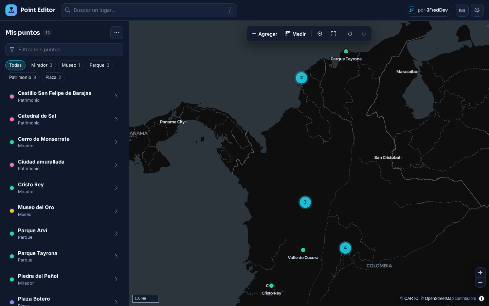
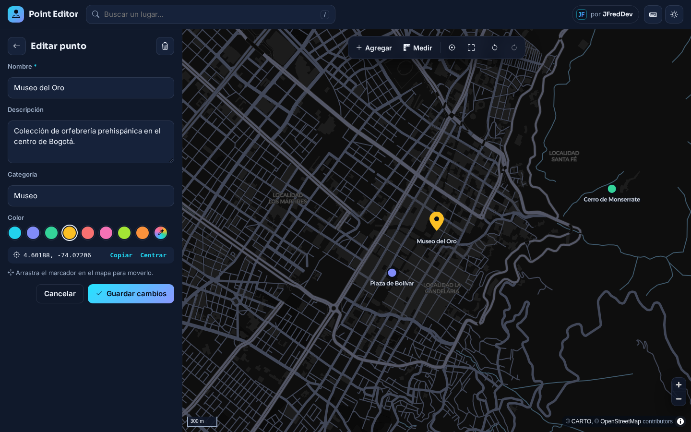
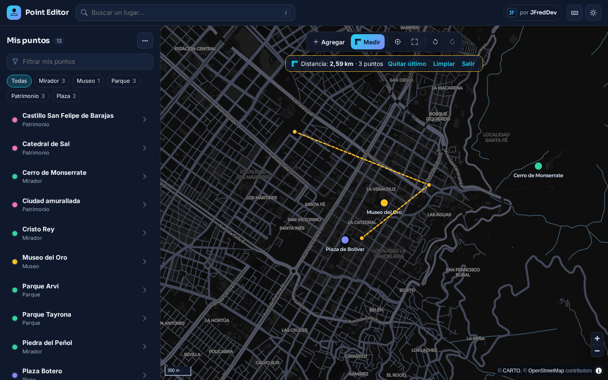
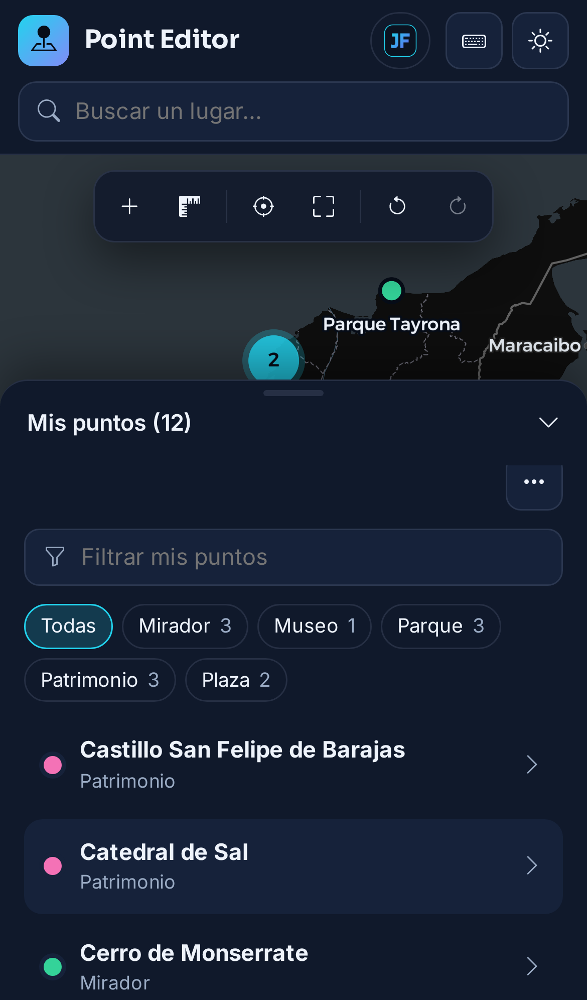
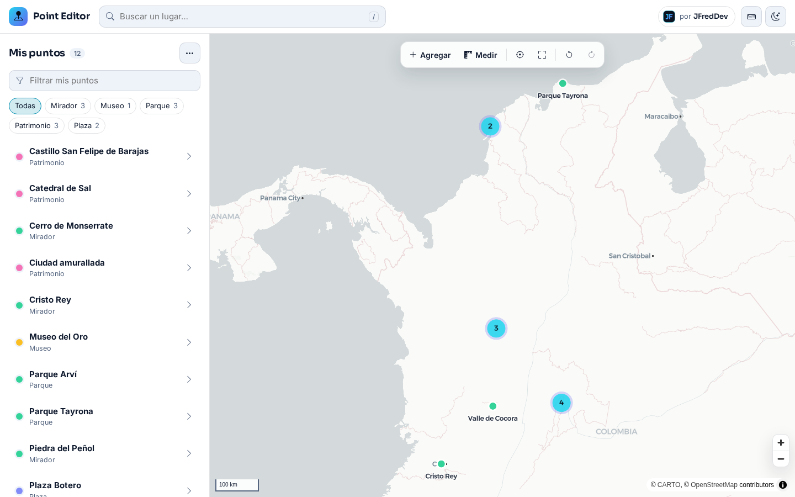

# Point Editor

Editor de puntos de interés sobre un mapa, hecho con **Angular 22** y **MapLibre GL**. Funciona completo en el navegador: no necesita servidor, cuentas ni API keys.

**Demo en vivo:** https://jfredmc.github.io/point-editor/



## Qué puedes hacer

- **Agregar puntos** con un clic en el mapa (o con el modo «Agregar»), con nombre, descripción, categoría y color.
- **Editar, mover y eliminar**: el punto seleccionado se arrastra en el mapa para cambiar su ubicación.
- **Deshacer y rehacer** cualquier cambio (Ctrl + Z / Ctrl + Shift + Z), también desde los avisos.
- **Buscar lugares** por nombre o dirección con OpenStreetMap Nominatim y agregarlos como punto.
- **Lista con filtros** por texto (sin importar tildes) y por categoría.
- **Mi ubicación**: centra el mapa en ti y ordena la lista por cercanía.
- **Medir distancias** trazando una ruta de varios tramos.
- **Clusters** para manejar muchos puntos sin saturar el mapa.
- **Importar y exportar** GeoJSON y CSV (detecta `,` o `;`, encabezados en español y comas decimales).
- **Se guarda solo** en `localStorage`; los datos del formato anterior se migran automáticamente.
- **Tema oscuro y claro**, diseño responsive con panel inferior en móvil y **atajos de teclado** (pulsa `?`).

| Editar un punto | Medir distancias | Móvil |
| --- | --- | --- |
|  |  |  |



## Atajos de teclado

| Tecla | Acción |
| --- | --- |
| `A` | Modo agregar punto |
| `N` | Nuevo punto en el centro del mapa |
| `M` | Medir distancias |
| `L` | Ir a mi ubicación |
| `F` | Encuadrar todos los puntos |
| `/` | Buscar un lugar |
| `D` | Cambiar tema |
| `Ctrl + Z` / `Ctrl + Shift + Z` | Deshacer / rehacer |
| `Supr` | Eliminar el punto seleccionado |
| `Esc` | Cancelar o cerrar |

## Formato de archivos

**GeoJSON**: un `FeatureCollection` con geometrías `Point`. Se leen las propiedades `name`/`nombre`, `description`/`descripcion`, `category`/`categoria` y `color` (hex). Los elementos que no son puntos o tienen coordenadas inválidas se descartan y se informa cuántos.

**CSV**: necesita columnas de latitud y longitud (`lat`/`latitud` y `lng`/`lon`/`longitud`). Ejemplo:

```csv
name,description,category,color,lat,lng
Museo del Oro,Orfebrería prehispánica,Museo,#fbbf24,4.60188,-74.07206
```

La exportación a CSV protege las celdas contra inyección de fórmulas en hojas de cálculo.

## Stack y decisiones

- **Angular 22** con componentes standalone, signals y `OnPush`, sin zone.js.
- **MapLibre GL 5** con mapas base gratuitos de **CARTO** (Positron y Dark Matter) sobre datos de © OpenStreetMap. No se usa ninguna API key.
- **Búsqueda** con [Nominatim](https://operations.osmfoundation.org/policies/nominatim/) respetando su política de uso: solo se busca al pulsar Enter (sin autocompletar), máximo una petición por segundo, resultados en caché y atribución visible.
- Estado en un store con signals (`PointsStore`) con historial de deshacer basado en instantáneas.
- Sin Bootstrap ni librerías de UI: CSS propio con variables para los dos temas.

```
src/app/
  core/         # lógica pura: geo (distancias), io (GeoJSON/CSV), historial, ejemplos
  services/     # PointsStore, MapService (MapLibre), GeocodingService, UiService
  components/   # mapa, panel lateral, editor, búsqueda
```

## Desarrollo

Requiere Node 22.

```bash
yarn install
yarn start          # http://localhost:4200
yarn test           # pruebas unitarias (Vitest)
yarn lint
yarn build:pages    # build como en GitHub Pages (/point-editor/)
yarn e2e            # pruebas e2e con Playwright (escritorio y móvil)
E2E_BASE_URL=https://jfredmc.github.io/point-editor/ yarn e2e   # contra el sitio en vivo
```

## CI y despliegue

- Cada PR pasa lint, typecheck, pruebas unitarias, build y la suite e2e en Chromium de escritorio y móvil.
- Cada push a `main` publica el sitio en GitHub Pages.

---

Hecho por [JFredDev](https://jfredmc.github.io/portfolio/).
